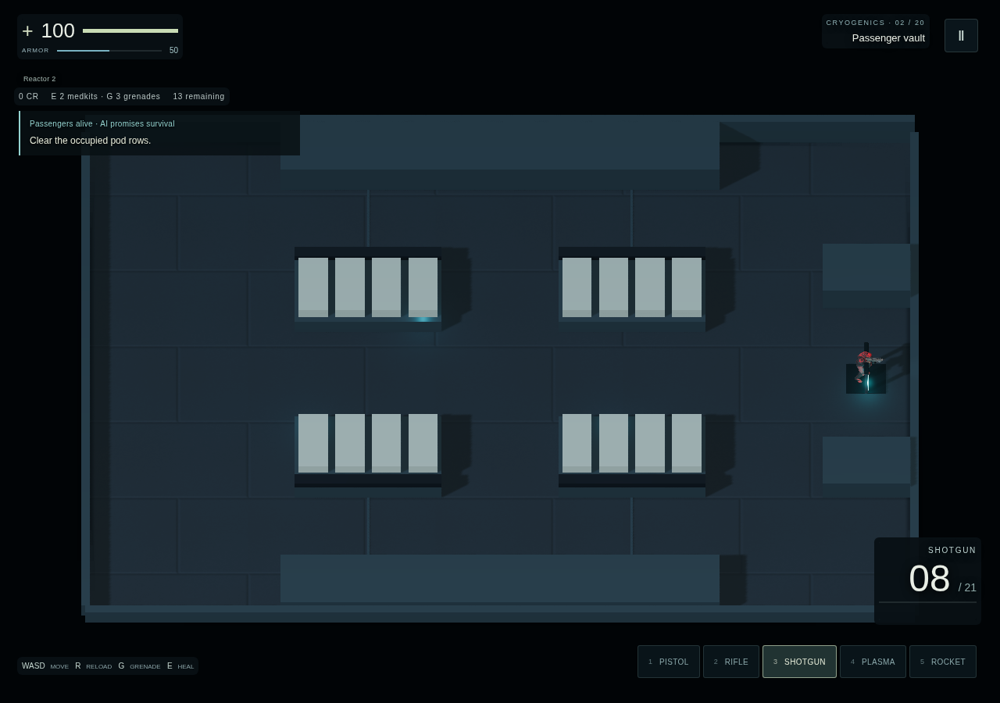
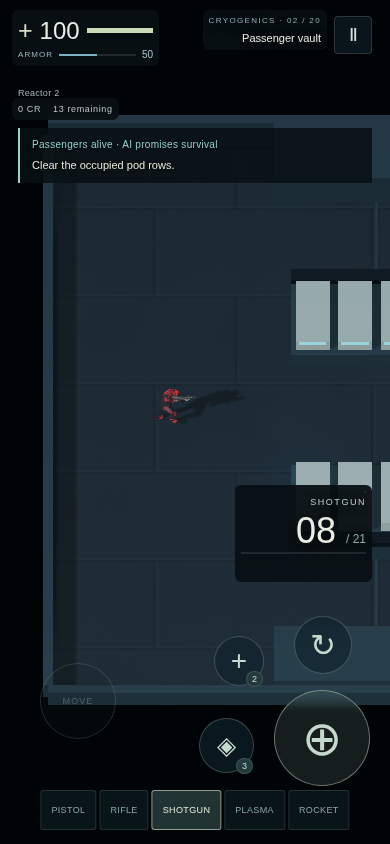

# Passenger Vault neutral blockout

Story and neutral layout gates passed independent review. Equipment is not accepted, and room 2 is not deployed.

- [Story](../../design/passenger-vault-story.md) and [annotated coordinate plan](../../design/passenger-vault-layout.md).
- [Final independent review](final-review.md) supersedes the earlier missing-evidence findings in [initial review](initial-review.md) and [follow-up CPU tests](followup-tests.md).
- [Manifest](manifest.json) contains all 14 original PNG hashes. Its original `pixelReview: pending` fields are preserved for provenance; `final-review.md` records the completed review.
- Capture source is `e3226a06328ca3cf442b361a0c60ba98bc63d69b`. Later commits add tests, documentation and these files only. Runtime and capture script are unchanged.

The twelve opening/inspection images use the shipping camera, HUD and High composer. Two `full-room` images are fitted overviews. The local-only capture build stages room 2, suppresses autonomous RAF and the encounter, and traverses using `DepthGame.update`. These are real rendered layout screenshots, not live-combat or unmodified-input smoke evidence.

Existing crawler-edge drop rejection, portrait HUD overlap and exit-marker overlap are documented in the final review. No pickup redesign, HUD change or global lighting/VFX adjustment is included. Finished chamber cues, actual gameplay video, full release verification and hosted delivery remain later gates.
