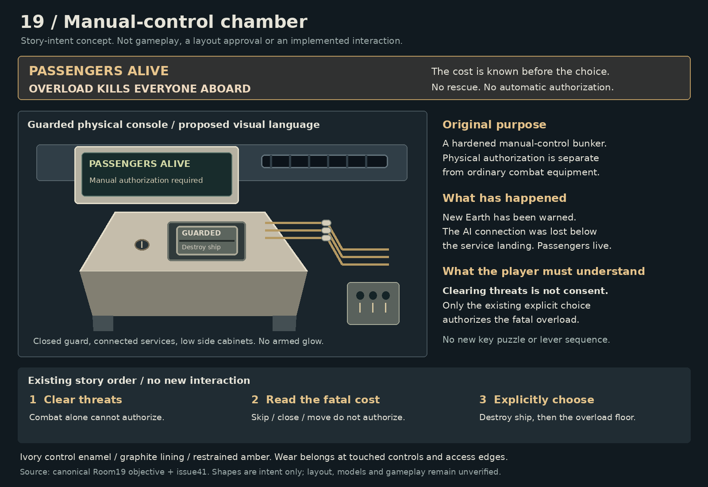

# Manual-control chamber story intent

Story concept only. Independent and parent review passed this stage, not layout, models, gameplay or human room acceptance.

## Purpose and known events

A hardened manual-control bunker gives a human operator a deliberate physical authorization point. New Earth has been warned. The AI connection was lost below the service landing. Passengers remain alive. The player must clear threats and understand that overload kills everyone aboard before explicitly choosing Destroy ship.

Canonical source: `src/game/roguelike/storyRooms.ts`, Room19 objective and Rooms10,14,18,20, at `7a3f262886104fb024de9684958b3f85a8859f34`. Room-specific art requirements: [issue41](https://github.com/cdb-lumen/containment/issues/41). Workflow: [issue21](https://github.com/cdb-lumen/containment/issues/21).

## Proposed visual language

A worn ivory sloped desk sits against graphite bunker lining. A large passenger-status panel is separate from a recessed guarded actuator. The two-stage guard and key socket are physical presentation of the existing explicit action, not a new key puzzle or a new authorization sequence. Hardwired services pass through pale ceramic feedthroughs. A narrow armored observation recess and low side cabinets support the control room's function. Restrained amber instrument light keeps the room quieter than the finale. Do not show an armed state before legitimate authorization.

PASSENGERS ALIVE / OVERLOAD KILLS EVERYONE ABOARD must precede Destroy ship. Skip, close, cancel, movement, touch dismissal and combat clear never count as consent. No rescue map, escape sign or survival promise.

## Review limits and next stage

The board's warning leads the guarded control. Its schematic guard does not yet establish two readable mechanical stages. The observation slit can resemble a vent; the single switch box only suggests side cabinets. Loom endpoints, insulation, attachment and wear need actual model work later. The board's text does not prove gameplay-scale display readability or confirmation safety.

Next is a whole-room layout draft under a new scheduler permit. Keep approach, combat space and explicit authorization distinct. No prior room asset is inherited. Runtime source, room geometry, camera, HUD and gameplay are unchanged.

The concept generator passed active-permit identity, four pinned canonical input hashes, PNG decode/dimensions and text-edge checks. No runtime tests, build, browser verification or gameplay capture ran. This concept is not release evidence. No merge or deployment.

