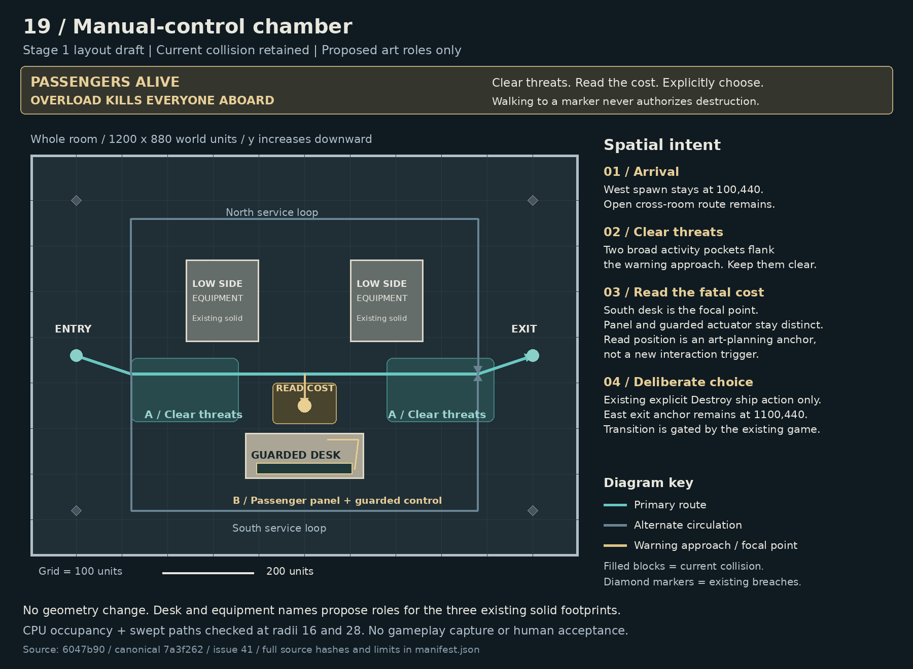

# Room19 layout draft

Stage1 diagram only. No runtime or model changes. The source-pinned manifest identifies the current geometry and the canonical brief.

## Spatial proposal

Retain the 1200 by 880 room, west spawn at 100,440, east exit at 1100,440, all four breaches and all three solid footprints. Give the two northern solids low control-equipment roles. Give the southern solid the guarded desk and separate passenger-status panel. Art labels propose roles, not implemented models. Hardwired services remain inside that solid footprint; no new floor clutter is proposed.

The main route crosses the open middle. Two combat activity pockets flank the south-facing warning approach. North and south loops retain alternate circulation. The read-cost point at 600,550 is a planning anchor, not a trigger. Existing explicit Destroy ship authorization remains the only intended progression action. Clear threats, skip, close, movement and dismissal are not consent. The exit marker is the retained geometry anchor, not an escape or automatic transition.

The canonical brief calls for a compact asymmetric bunker. This draft deliberately keeps the existing symmetric collision baseline. Asymmetry can come from later wall-mounted equipment and art composition, subject to a later permit and clearance checks. This stage does not claim to have implemented that detailed composition, the observation recess, gameplay-scale warning legibility or mechanical guard construction.

## Reproduction

Run from an installed worktree, with Python Pillow available:

```sh
node validate-layout.cjs /absolute/path/to/worktree
python3 draw-layout.py /absolute/path/to/worktree
```

The validator imports the actual current room template, geometry factory, occupancy and swept-traversal helpers. It exports the same coordinates used by the generator. The generator checks the active delegated permit and all four canonical input hashes, then writes layout.png and manifest.json. Rerendering intentionally requires the active attempt1028 permit. To inspect a frozen later copy, use the pinned manifest and existing PNG rather than changing the guard.

## Focused results

70 CPU assertions passed. At 20-unit grid spacing, radius16 has 2034 usable samples in one connected component; radius28 has 1990 in one component. No sampled occupancy/sweep disagreement. All shown route segments pass production swept traversal at both radii. Activity anchors and inward-offset breach spawn points connect to the grid.

Three selected StoryRoute tests passed, six skipped. They check immutable canonical names/objectives, fixed twenty-room route order and essential status/UI source contracts. They do not exercise manual-control gameplay or input confirmation safety.

No live gameplay, continuous-space proof, browser capture, model acceptance or human approval is claimed. Parent and independent visual review remain required.


