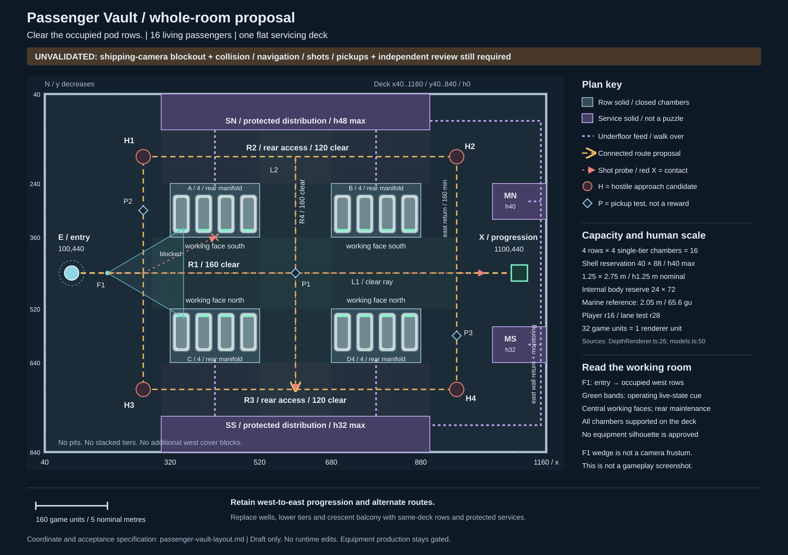

# Passenger Vault whole-room layout proposal

**Neutral layout gate: PASS.** The story gate passed first. The coordinate plan below is implemented as a low-detail blockout at `e3226a06328ca3cf442b361a0c60ba98bc63d69b`. [Independent final review](../art-evidence/passenger-blockout/final-review.md) accepts the spatial reservations after desktop/portrait evidence and production collision, navigation, projectile and pickup tests. This is not equipment acceptance or release readiness. Earlier proposal reviews remain historical records of the then-unvalidated state.

## Story and source authority

Keep the objective exactly **Clear the occupied pod rows.** Room 2 broadens the stakes from the player's released berth to living sleeping passengers, before Residential Gallery shows domestic life. Closed chambers and operating services must communicate this without dialogue. No exposed bodies, failed evacuation, rescue route, life-support timer, power puzzle, destructible passenger system or early AI-betrayal evidence.

Sources inspected for this proposal:

- [Reviewed story](passenger-vault-story.md), especially lines 14–36, and [independent story review](passenger-vault-story-review.md), lines 3–18. Capacity, outline and service arrangement are explicitly design choices.
- [Canonical campaign](../../src/game/roguelike/storyRooms.ts), lines 3–23 and 32–36. This controls objective, sequence and disclosure timing, rather than the older twelve-room description in the root README.
- Shared scenario, `/home/chernodubv/dev/hermes-obsidian/Projects/Containment Depth - Scenario.md`, lines 9–19, 24–30 and 44–59. Lines 69–77 and 111–121 are interaction candidates, not requirements.
- User-directed production reset, `/home/chernodubv/.hermes/workspaces/containment-art-roadmap/approved-production-process.md`, lines 22–32, plus native-scale requirement at line 14. Story precedes whole-room layout; equipment starts only after both independent gates pass.
- Repository [README](../../README.md), development and evidence instructions. No repository `AGENTS.md` or `CLAUDE.md` was found. Source checkout at inspection: `7668ae105cc2ec2e363b38092152ef2d6047d7e7`.

The absolute source paths above identify inspected external documents; they are not portable repository links. All dimensions and arrangements below are proposals, not canonical passenger counts or established events.

## Whole-room choice

Use a flat passenger servicing hall with four short, single-tier occupied rows, arranged around an open inspection crossing. Each row is an island with rear utility access. The four islands divide pursuit and fire lanes without stranding passengers in pits. Entry opens onto the working faces of the west pair; east-side monitoring faces the return aisle. Protected utility distribution follows the perimeter and passes beneath flush deck panels to the islands.

This is a 16-passenger section of the ship, not the ship's total population. Four chambers per row keep every occupied position adjacent to a usable working aisle. The count comes from fitting human-scale chambers and access into four short rows, not from the inherited 28-chamber render or an equipment-production quota.

## Scale contract

Game coordinates use `x` east and `y` south. The drawing uses the same axes, with north at the top. Elevation `h` is above the common deck. Renderer coordinates are `X=x/32`, `Z=y/32`, `Y=h/32`.

- [DepthRenderer](../../src/render/DepthRenderer.ts), line 26, defines `UNIT=32`; actor and room placements divide game coordinates by it. [AuthoredRooms](../../src/render/AuthoredRooms.ts), lines 10–14, uses the same divisor.
- [Marine rig](../../src/render/models.ts), line 50, requests a height of 2.05 renderer units. That is 65.6 game units. Use one renderer unit as one nominal metre for this design, consistent with the [existing weapon-scale audit](../audits/pass5-weapons.md), lines 7–23. This is the project's physical-scale convention, not a real-world building-code certification. Do not use the rejected 50-unit benchmark conversion.
- [Player](../../src/DepthGame.ts), line 31, has radius 16, a 1 m nominal collision diameter. [Brute](../../src/game/enemies/catalog.ts), line 40, has radius 28. [Story template contract](../../src/game/roguelike/storyRoomTemplates.ts), line 5, requires radius-28 lanes. A gameplay collision circle is not a measurement of a passenger's body.

| Reservation | Game units | Nominal metres | Reason |
|---|---:|---:|---|
| Camera envelope | 1200 × 880 | 37.5 × 27.5 | Retain the current template envelope |
| Interior deck | 1120 × 800 | 35 × 25 | Includes solids and operating space, 875 m² gross |
| One four-passenger row | 200 × 120 | 6.25 × 3.75 | Contains chambers, supports and rear manifold |
| Closed chamber envelope | 40 × 88, maximum h40 | 1.25 × 2.75, h1.25 | Horizontal human-scale reservation, not a finished silhouette |
| Minimum internal body reservation | 24 × 72 | 0.75 × 2.25 | Leaves length beyond the 2.05 m marine reference; fit still needs a blockout |
| Chamber pitch | 50 | 1.5625 | Separation is inside the solid row, not a tiny walking gap |
| Main crossing and centre spine | 160 clear | 5 | Shared inspection and combat route |
| North/south rear-access aisle | 120 clear | 3.75 | Maintenance route with room to turn |

A 120-wide aisle has 64 units of centre-position width after radius-28 clearance from both sides; a 160-wide aisle has 104. These are dimensional checks only, not a traversal or navigation pass. Capacity is `4 rows × 4 single-tier chambers = 16 living passengers`. No concealed lower tier or inaccessible chamber is allowed.

## Coordinate plan

Bounds are closed min/max pairs in game units. Touching the bank's perimeter is a solid contact. The SVG is a same-scale plan; annotation symbols do not create gameplay objects.

| ID | Bounds or point | Treatment and function |
|---|---|---|
| D | Boundary vertices `40,40; 1160,40; 1160,840; 40,840` | Flat continuous floor at h0. Outer wall thickness belongs outside this interior boundary |
| E | Spawn `100,440`; entry apron `x40..280, y360..520` | Arrival presentation from Awakening Bay, not a new traversable connection between maps |
| X | Exit `1100,440`; exit apron `x960..1160, y360..520` | Existing campaign progression affordance toward Residential Gallery, not an escape door |
| A | `x320..520, y240..360` | Four occupied closed chambers, working face south |
| B | `x680..880, y240..360` | Four occupied closed chambers, working face south |
| C | `x320..520, y520..640` | Four occupied closed chambers, working face north |
| D4 | `x680..880, y520..640` | Four occupied closed chambers, working face north |
| SN | `x300..900, y40..120` | Solid north life-support distribution reservation, h48 maximum, maintenance face south |
| SS | `x300..900, y760..840` | Solid south distribution reservation, h32 maximum to limit foreground occlusion, maintenance face north |
| MN | `x1040..1160, y240..320` | Solid monitoring/service reservation, h40 maximum, working face west |
| MS | `x1040..1160, y560..640` | Solid monitoring/service reservation, h32 maximum, working face west |
| H1/H2 | `260,180` / `960,180` | Candidate north hostile approach anchors |
| H3/H4 | `260,700` / `960,700` | Candidate south hostile approach anchors |

Use `voids` or equivalent sealed solid footprints for A/B/C/D4 and service reservations during implementation. These are not holes in the proposed floor and must not display wells. Do not retain the old two west obstacles in addition to this list. Eight listed reservations are the complete proposed interior solid set; wall solids remain separate. Services meet the boundary with solid backs and sides, eliminating player-only rear gaps. Visible base volumes and query solids must coincide.

### Occupied positions and service access

For A and C, chamber left edges are `325,375,425,475`; for B and D4 they are `685,735,785,835`. Every chamber is 40 wide. A/B chamber bounds are `y264..352`; C/D4 bounds are `y528..616`. This explicitly places all 16 chambers inside their row reservations. Northern row manifolds occupy `y240..256`; southern manifolds occupy `y624..640`, within their own rows. Chamber bases and supports reach the deck. No floating or stacked trays.

The central aisle supplies working positions at each chamber centre `x`, with `y400` facing north for A/B and `y480` facing south for C/D4. Radius-28 standing envelopes fit outside row solids. These positions are reservations for readable human servicing, not new staff actors or interactions. Space between chambers remains sealed infill, not navigation. Any future lid or access panel must retract within the row reservation; no door swing may consume a marked aisle.

SN feeds A/B beneath the deck along `x420` and `x780`, from `y120` to `y248`; SS feeds C/D4 along the same x values from `y760` to `y632`. Dashed violet lines show these protected underfloor connections. They are flush and traversable, not raised pipes. Return distribution and monitoring run inside the east perimeter wall. In the SVG, `x1148` is an inset annotation for that wall channel, not a freestanding solid in the floor. Flush underfloor branches connect SN/SS to it along `y100` and `y780`, and MN/MS along `y280` and `y600`. Show broad live-state bands at row working faces, restrained and readable at gameplay scale; their exact asset design is deferred. Do not add tiny labels as the only evidence of living occupancy.

Maintenance reaches SN from `y180`, SS from `y700`, northern row rear faces from `y180`, and southern row rear faces from `y700`. MN/MS have clear west approaches through `x880..1040`, with operator centres at `1000,280` and `1000,600`. Underfloor routing is a service construction assumption, not a hidden playable level or an invented failure event.

## Circulation, combat and focal views

All corridors are on the same deck. Service aprons are walkable and count as combat floor, not invisible exclusion zones.

- Direct crossing R1 follows `100,440 → 1100,440`. Between rows its clear strip is `y360..520`. It exposes the player to long east/west fire but gives an immediate, legible route and working-face view.
- North loop R2 follows `100,440 → 260,440 → 260,180 → 960,180 → 960,440 → 1100,440`. The full-width rear aisle between service rail and rows is `y120..240`.
- South loop R3 mirrors it through `y700`; its rear aisle is `y640..760`.
- Central transfer R4 follows `600,180 → 600,700`, inside `x520..680`. The player can switch loops midway instead of returning to an endpoint. West row ends have `x40..320` clearance; the east return has at least `x880..1040` alongside monitoring solids.

The four row rectangles interrupt oblique fire and direct pursuit. Corners supply short occlusion breaks; the crossing, rear aisles and central transfer remain exposed. Do not add incidental cover to fill apparently empty lanes. H1–H4 are encounter-entry proposals, not proof of the aliens' historical intrusion route. Preserve shipping wave composition, warning timing and spawn-safety rules. Actual breach facing and the existing 56-unit spawn offset in `DepthGame.ts:88` must be resolved during blockout, not copied blindly from these nominal anchors.

The SVG marks three useful views/tests:

1. F1 at `180,440`, looking toward the west working faces near `350,340` and `350,540`. Entry should contain the player, one recognizably closed occupied row and open floor. This wedge is design intent, not a camera frustum.
2. L1 along `y440`, from `180,440` to `1020,440`. This should be a clear shot corridor. Use the separate oblique ray below for the blocked-row expectation; no row intersects L1. No shoot-through chamber windows.
3. L2 along `x600`, from `600,180` to `600,700`. This gives a north/south transfer sightline. Test oblique blocked ray `260,440 → 780,180` across A as a contrasting solid-contact case.

Pickup probes P1 `600,440`, P2 `260,300`, P3 `960,580` sample centre and both returns. They are test locations, not authored rewards. Also test real drops at every row corner and service face, ordinary attraction near solids and collection after room clear. Admitted pickups must occupy reachable floor. Preserve the existing radius-16 placement rejection when a radius-14 crawler dies too close to a solid; a successful chance roll does not guarantee a created pickup. No relocation mechanic is added. Preserve the existing room-clear auto-collection sweep, which intentionally awards remaining drops without a player-to-pickup route. Do not redesign the pickup system in this layout slice.

## Retain/change decisions

| Inherited element | Decision | Story/use rationale and risk |
|---|---|---|
| 1200 × 880 template, west spawn `100,440`, east exit `1100,440` | Retain | Keeps known progression anchors and camera envelope while changing interior use. Does not certify framing |
| Polygonal crescent perimeter | Replace with straight serviced hall | Orthogonal walls support protected distribution and equal-depth operating aisles. Curved balcony has no required story role |
| Two sloped wells and lower tiers | Remove | Every sleeping passenger needs visible same-deck servicing. Pits and hidden occupants do not satisfy this purpose |
| Short exposed east/west cross-aisle | Retain route principle, derive width anew | A 160-wide inspection crossing follows from opposed working faces. Its matching inherited width is not approval of the old wells |
| Outer alternate circulation | Retain route principle, replace shape | Rear maintenance access creates two loops. Add a centre transfer between four short rows |
| Two west obstacles | Remove | Entry should explain occupancy and usable circulation, not hide the first working face behind unrelated blocks |
| Four hostile approaches | Retain count, reposition anchors | Maintains multiple approach directions without specifying new encounter mechanics; spawn offset/navigation remain untested |
| Old chamber silhouettes and 28 rendered passengers | Do not inherit | New count and envelope come from human scale and single-tier access. No asset reuse or assembly-production decision at this gate |

Inherited comparison is grounded in [authored topology](../../src/game/roguelike/authoredRoomTopologies.ts), lines 47–54, and [existing passenger renderer](../../src/render/AuthoredRooms.ts), lines 411–425. The rectangular footprint list in `storyRoomTemplates.ts:8` is overridden by the authored topology at lines 29–35; it is not the shipping room outline.

## Blockout gate and handoff

**Neutral blockout validated.** The original coordinate proposal is now implemented and independently reviewed. [Capture manifest](../art-evidence/passenger-blockout/manifest.json), [behavioral follow-up](../art-evidence/passenger-blockout/followup-tests.md) and [final review](../art-evidence/passenger-blockout/final-review.md) record the gate outcome. The checklist below remains the evidence contract, not unfinished work by itself. Live combat presentation, finished assets, full release verification and hosted delivery remain later gates.

The next equipment writer must preserve the implemented floor, row and service reservations from this coordinate list, with the same boundary and solid set used by rendering, collision, navigation and projectile queries. Do not restore inherited wells. Keep the common deck, conservative contact faces and closed living-passenger cues. Heights remain conservative upper bounds; material changes to layout require renewed evidence.

Required evidence before layout passes:

- Shipping desktop and portrait opening views, plus traversed views at F1, each rear loop, central transfer and exit. Use the shipping camera offset `0,26,19`, current zoom/follow and HUD, as defined in [DepthRenderer](../../src/render/DepthRenderer.ts) and [roomFraming](../../src/render/roomFraming.ts). Passenger Vault has no Awakening-only portrait focus bias. A top-down overview or custom zoom cannot substitute. Check foreground SS/MS and row C/D4 do not hide actors or status cues.
- Production actor-radius occupancy and swept traversal for R1–R4, every working/maintenance position and entry/exit; player radius 16 and required radius 28. Include corners, diagonal movement and actual encounter radii. Dimensional margin alone is not sufficient.
- Production enemy navigation from all four real breach spawn positions, including facing offsets and fallback candidates, to player positions on every loop. Verify no isolated regions, clipped spawn, single mandatory choke or long corner stall.
- Real projectile traces through L1/L2 and into/along each row and service face, including the blocked oblique case, grenades, pickups and relevant impact effects. The neutral visible solids and query contacts must agree. Passengers remain non-destructible scenery; no protection mechanic is introduced.
- Real drop, attraction and collection checks at P1–P3, all row corners and service edges. Prove reachable placement and inspect ordinary attraction near solids. Preserve room-clear auto-collection, campaign rewards and progression; the clear-room sweep does not require a physical collection path.
- Independent layout/spec review against the reviewed story, then evidence review. If camera readability or encounter traversal fails, revise this plan and blockout together before equipment planning. Any required wave/progression redesign is a scope escalation, not a quiet layout fix.

The neutral layout pass permits deriving a new equipment plan. It does not accept equipment or establish release readiness or real-device performance.
